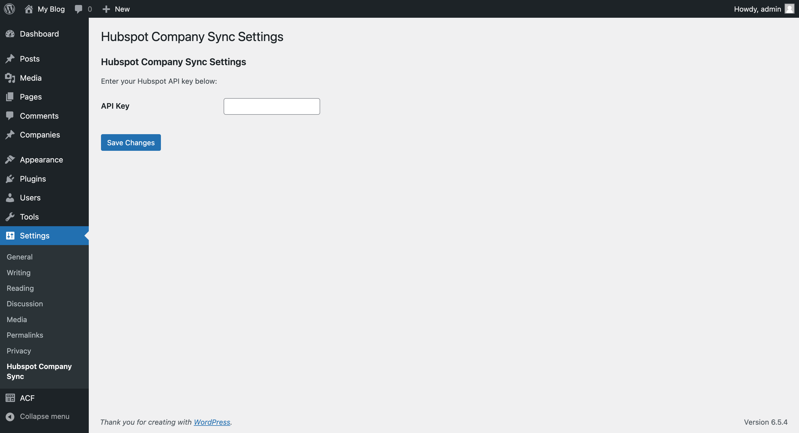
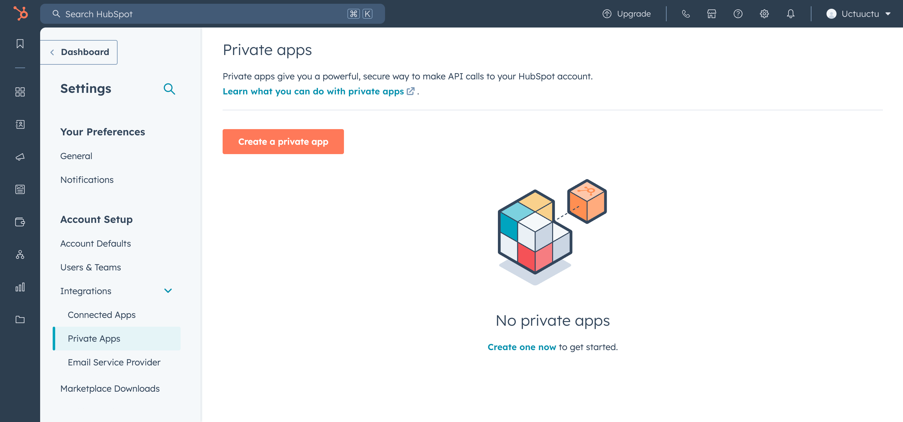
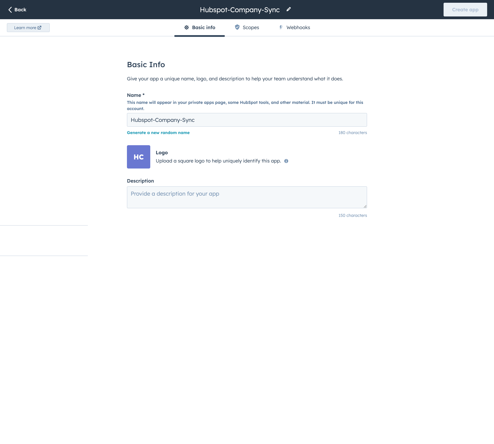
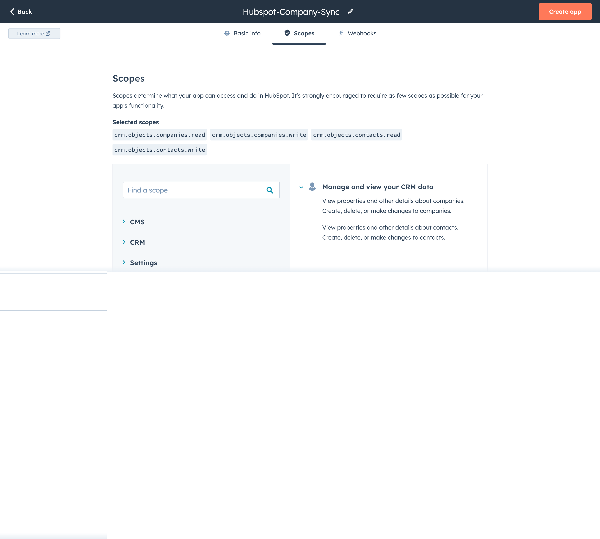
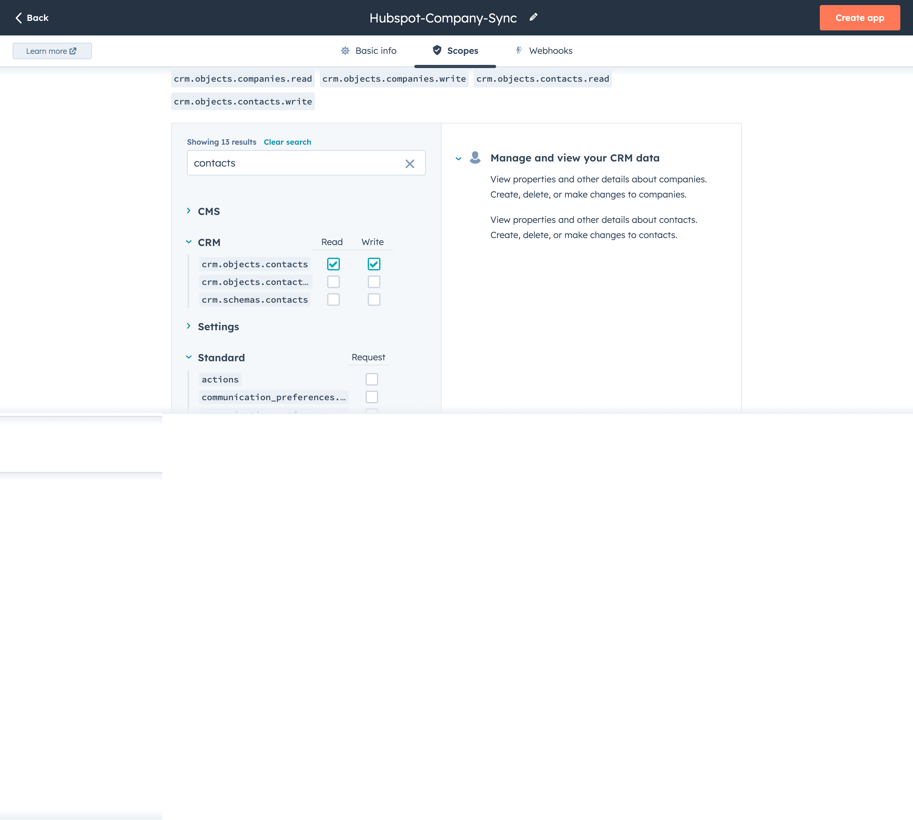
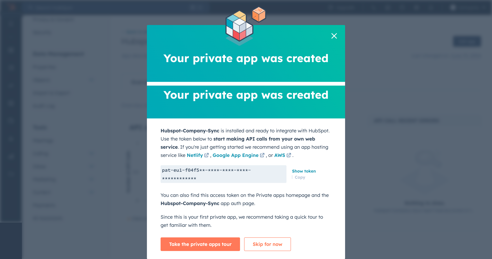

# About
This plugin is about syncing HubSpot and WordPress. Custom post types and taxonomy structures in WordPress can be synced with HubSpot. This plugin uses custom post types and taxonomies that are created. If you want, you can change all the data yourself. Basic usage is below.

## Installation
1. Upload the plugin files to the `/wp-content/plugins/plugin-name` directory, or install the plugin directly through the WordPress plugins screen.
2. Activate the plugin through the 'Plugins' screen in WordPress.
3. Use the Settings->Plugin Name screen to configure the plugin.
4. You need to create an account and get the API key from HubSpot. You can create a private application at HubSpot Private Apps.
5. When you create a private application, you must grant the following permissions: `crm.objects.companies.write`, `crm.objects.companies.read`, `crm.objects.contacts.read`, `crm.objects.contacts.write`, `crm.schemas.contacts.write`, `crm.schemas.companies.read`, `crm.schemas.companies.write`, `crm.schemas.contacts.read`.
6. After activating the WordPress plugin, go to the settings page, enter the API key, and save it.
7. You need to create custom post types and taxonomies in WordPress. You can create them using the ACF plugin. I am sharing an ACF Options JSON file with you. You can import it to your ACF plugin to create the custom post types and taxonomies.

# HubSpot Installation

## Step 1

## Step 2

## Step 3

## Step 4

## Step 5

## Step 6

